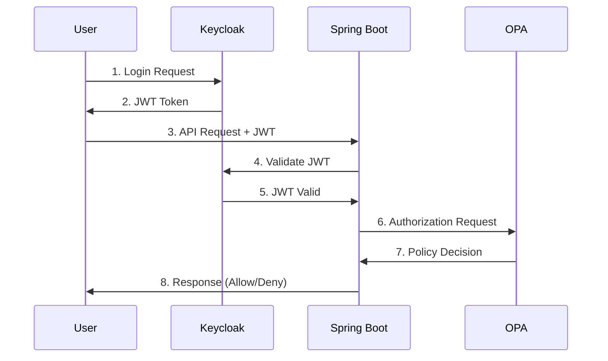

# OPA Spring Boot with Keycloak Demo - Production Ready

This demo shows how to integrate Open Policy Agent (OPA) with Spring Boot for authorization using production-grade patterns and best practices.

## What is OPA?

Open Policy Agent (OPA) is an open-source, general-purpose policy engine that enables unified, context-aware policy enforcement across your entire technology stack. OPA provides:

- **Policy as Code**: Write authorization policies in Rego, a declarative language
- **Decoupled Architecture**: Separate policy decisions from application logic
- **Universal Integration**: Works with APIs, microservices, Kubernetes, CI/CD pipelines, and more
- **High Performance**: Fast policy evaluation with minimal latency
- **Cloud Native**: CNCF graduated project designed for modern architectures

OPA acts as a lightweight policy engine that your applications can query to make authorization decisions, removing the need to hardcode complex authorization logic in your business code.

## Production Features

### 🔧 **Configuration Management**
- ✅ **Externalized Configuration**: Environment variables for all settings
- ✅ **Type-Safe Properties**: Validated configuration with `@ConfigurationProperties`
- ✅ **Profile Support**: Development, production, and Docker profiles
- ✅ **Graceful Shutdown**: Proper application lifecycle management

### 🛡️ **Security**
- ✅ **JWT Authentication**: Keycloak integration with token validation
- ✅ **Method-Level Security**: `@PreAuthorize` annotations
- ✅ **Security Headers**: HSTS, Content-Type, Frame Options, Referrer Policy
- ✅ **Input Validation**: Comprehensive validation with custom patterns
- ✅ **CORS Configuration**: Configurable cross-origin resource sharing

### 🔄 **Resilience & Reliability**
- ✅ **Circuit Breaker**: Resilience4j integration for fault tolerance
- ✅ **Retry Mechanism**: Exponential backoff for transient failures
- ✅ **Timeout Handling**: Configurable timeouts for external calls
- ✅ **Fail-Closed Security**: Deny access when OPA is unavailable
- ✅ **Health Checks**: Custom health indicators for dependencies

### 📊 **Monitoring & Observability**
- ✅ **Prometheus Metrics**: Custom metrics for authorization requests
- ✅ **Request Tracing**: Correlation IDs for distributed tracing
- ✅ **Structured Logging**: JSON-formatted logs with context
- ✅ **Actuator Endpoints**: Health, metrics, and info endpoints
- ✅ **Performance Monitoring**: Timer metrics for OPA calls

### 🚨 **Error Handling**
- ✅ **Global Exception Handler**: Centralized error processing
- ✅ **Error IDs**: Unique identifiers for error tracking
- ✅ **Validation Errors**: Detailed field-level error messages
- ✅ **Custom Exceptions**: Business-specific error types
- ✅ **Proper HTTP Status**: Correct status codes for different scenarios

### 📝 **API Documentation**
- ✅ **OpenAPI 3.0**: Comprehensive API documentation
- ✅ **Swagger UI**: Interactive API explorer
- ✅ **Request/Response Examples**: Detailed endpoint documentation
- ✅ **Security Schemes**: JWT authentication documentation

### 🐳 **Production Deployment**
- ✅ **Multi-Stage Dockerfile**: Optimized container builds
- ✅ **Docker Compose**: Complete stack with PostgreSQL and monitoring
- ✅ **Non-Root Execution**: Security-hardened containers
- ✅ **Health Checks**: Container and application health monitoring
- ✅ **Prometheus Integration**: Metrics collection and monitoring

### ⚡ **Performance**
- ✅ **Connection Pooling**: Optimized HTTP client configuration
- ✅ **JWT Caching**: Cached JWT validation for performance
- ✅ **Async Processing**: Non-blocking I/O for external calls
- ✅ **JVM Optimization**: Container-aware JVM settings

## What This Application Does

This application demonstrates **externalized authorization** - separating authorization decisions from business logic. Instead of hardcoding "who can access what" in your Spring Boot code, we delegate these decisions to OPA (Open Policy Agent).

### The Problem We're Solving
Traditional applications embed authorization logic directly in code:
- Authorization rules scattered throughout the codebase
- Hard to change permissions without code deployment
- Difficult to audit and test authorization logic
- Can't reuse policies across different services

### Our Solution
We separate concerns:
- **Spring Boot**: Handles business logic (serving documents)
- **OPA Server**: Makes authorization decisions based on policies
- **Policy File**: Defines rules in declarative Rego language
- **Keycloak**: Provides JWT authentication

### Example Flow
```
User Request → Keycloak (Auth) → Spring Boot → OPA Filter → Policy Check → Allow/Deny → Response
```

When Alice requests a document:
1. Keycloak validates JWT token
2. Spring Boot extracts username from JWT
3. OPA filter asks: "Can alice read document:1?"
4. OPA checks policy: "Alice can read any document"
5. OPA returns: `{"result": true}`
6. Spring Boot serves the content

When Bob tries to access document:2:
1. Same authentication process
2. OPA policy says "Bob can only read document:1"
3. OPA returns: `{"result": false}`
4. Filter returns "Access denied" (403)

**Result**: Authorization rules are now version-controlled, testable, reusable, and updatable without code changes.

## Prerequisites

### Install Required Software

#### 1. Install Java 21
```bash
# macOS with Homebrew
brew install openjdk@21

# Ubuntu/Debian
sudo apt update && sudo apt install openjdk-21-jdk

# Windows - Download from https://adoptium.net/
```

#### 2. Install Maven
```bash
# macOS
brew install maven

# Ubuntu/Debian
sudo apt install maven

# Windows - Download from https://maven.apache.org/download.cgi
```

#### 3. Install Docker
Required for running Keycloak. Install from [docker.com](https://www.docker.com/get-started)

#### 4. Install OPA

##### macOS
```bash
# Using Homebrew (Recommended)
brew install opa

# Or download binary
curl -L -o opa https://openpolicyagent.org/downloads/v0.59.0/opa_darwin_amd64_static
chmod 755 ./opa
sudo mv opa /usr/local/bin/
```

##### Linux
```bash
# Download binary
curl -L -o opa https://openpolicyagent.org/downloads/v0.59.0/opa_linux_amd64_static
chmod 755 ./opa
sudo mv opa /usr/local/bin/

# Or using package manager (Ubuntu/Debian)
curl -L -o opa.deb https://openpolicyagent.org/downloads/v0.59.0/opa_linux_amd64.deb
sudo dpkg -i opa.deb
```

##### Windows
```powershell
# Download binary
Invoke-WebRequest -Uri https://openpolicyagent.org/downloads/v0.59.0/opa_windows_amd64.exe -OutFile opa.exe
# Move to a directory in your PATH

# Or using Chocolatey
choco install opa

# Or using Scoop
scoop install opa
```

#### 5. Install jq (for JSON processing)
```bash
# macOS
brew install jq

# Ubuntu/Debian
sudo apt install jq

# Windows
choco install jq
```

## Project Structure

```
opa-springboot-demo/
├── src/main/java/com/opa/demo/
│   ├── OpaSpringBootDemoApplication.java    # Main application class
│   ├── config/
│   │   ├── SecurityConfig.java              # Enhanced security configuration
│   │   └── OpaProperties.java               # Type-safe configuration properties
│   ├── controller/
│   │   ├── DemoController.java              # Production-grade REST endpoints
│   │   └── PublicController.java            # Public endpoints
│   ├── exception/
│   │   └── GlobalExceptionHandler.java      # Comprehensive error handling
│   ├── filter/
│   │   └── OpaAuthorizationFilter.java      # OPA authorization filter
│   ├── health/
│   │   └── OpaHealthIndicator.java          # Custom health checks
│   └── service/
│       └── OpaService.java                  # Resilient OPA communication
├── src/main/resources/
│   ├── application.yaml                     # Main configuration
│   └── application-production.yaml          # Production configuration
├── policy.rego                              # OPA authorization policies
├── Dockerfile                               # Multi-stage production build
├── docker-compose.yml                       # Complete production stack
├── prometheus.yml                           # Monitoring configuration
├── start-keycloak.sh                        # Keycloak startup script
├── start-opa.sh                             # OPA startup script
├── get-tokens.sh                            # Token retrieval script
├── test-all.sh                              # Automated test script
├── debug.sh                                 # Debug and troubleshooting
├── pom.xml                                  # Maven dependencies
└── README.md                                # This file
```

## Quick Start Guide

### Step 1: Clone and Build the Application
```bash
# Clone the repository (if not already done)
git clone <repository-url>
cd opa-springboot-demo

# Build the application
./mvnw clean compile
```

### Step 2: Start Keycloak
```bash
# Start Keycloak container
./start-keycloak.sh

# Wait for Keycloak to start (about 30-60 seconds)
# You'll see "Keycloak started" in the logs
```

### Step 3: Configure Keycloak
1. **Open Keycloak Admin Console**: http://localhost:8080
2. **Login**: Username: `admin`, Password: `admin`
3. **Create Realm**:
   - Click "Create Realm" button (or dropdown next to "master")
   - Realm name: `demo`
   - Click "Create"

4. **Create Client**:
   - Go to "Clients" → "Create client"
   - Client ID: `opa-demo`
   - Client type: `OpenID Connect`
   - Click "Next"
   - Client authentication: `OFF` (public client)
   - Authorization: `OFF`
   - Authentication flow: Check "Direct access grants"
   - Click "Next"
   - Root URL: `http://localhost:8081`
   - Home URL: `http://localhost:8081`
   - Valid redirect URIs: `http://localhost:8081/*`
   - Valid post logout redirect URIs: `http://localhost:8081/*`
   - Web origins: `http://localhost:8081`
   - Click "Save"

5. **Create Users**:
   - Go to "Users" → "Create new user"
   - Create three users with these details:
   
   **User 1 - Alice**:
   - Username: `alice`
   - Email: `alice@example.com`
   - First name: `Alice`
   - Last name: `Smith`
   - Email verified: `Yes`
   - Enabled: `Yes`
   - Click "Create"
   - Go to "Credentials" tab → "Set password"
   - Password: `password`
   - Password confirmation: `password`
   - Temporary: `OFF`
   - Click "Save"
   
   **User 2 - Bob**:
   - Username: `bob`
   - Email: `bob@example.com`
   - First name: `Bob`
   - Last name: `Johnson`
   - Email verified: `Yes`
   - Enabled: `Yes`
   - Password: `password` (same process as Alice)
   
   **User 3 - Admin**:
   - Username: `admin`
   - Email: `admin@example.com`
   - First name: `Admin`
   - Last name: `User`
   - Email verified: `Yes`
   - Enabled: `Yes`
   - Password: `password` (same process as Alice)

### Step 4: Start OPA Server
```bash
# In a new terminal window
./start-opa.sh

# You should see: "OPA started and listening on :8181"
```

### Step 5: Start Spring Boot Application
```bash
# In a new terminal window
./mvnw spring-boot:run

# Wait for the application to start
# You should see: "Started OpaSpringBootDemoApplication"
```

### Step 6: Verify Everything is Running
```bash
# Check Keycloak
curl http://localhost:8080/health

# Check OPA
curl http://localhost:8181/health

# Check Spring Boot
curl http://localhost:8081/actuator/health
```

All three should return successful responses.

## Testing the Application

### Quick Test (Automated)
```bash
# Run all tests automatically
./test-all.sh
```
This script will:
- Check if all services are running
- Get JWT tokens for all users
- Test all authorization scenarios
- Verify expected responses

### Manual Testing

### Get JWT Tokens

#### Option 1: Use the provided script
```bash
./get-tokens.sh
```

#### Option 2: Get tokens manually
```bash
# Get Alice's token
ALICE_TOKEN=$(curl -s -X POST http://localhost:8080/realms/demo/protocol/openid-connect/token \
  -H "Content-Type: application/x-www-form-urlencoded" \
  -d "grant_type=password" \
  -d "client_id=opa-demo" \
  -d "username=alice" \
  -d "password=password" | jq -r '.access_token')

echo "Alice Token: $ALICE_TOKEN"

# Get Bob's token
BOB_TOKEN=$(curl -s -X POST http://localhost:8080/realms/demo/protocol/openid-connect/token \
  -H "Content-Type: application/x-www-form-urlencoded" \
  -d "grant_type=password" \
  -d "client_id=opa-demo" \
  -d "username=bob" \
  -d "password=password" | jq -r '.access_token')

echo "Bob Token: $BOB_TOKEN"

# Get Admin's token
ADMIN_TOKEN=$(curl -s -X POST http://localhost:8080/realms/demo/protocol/openid-connect/token \
  -H "Content-Type: application/x-www-form-urlencoded" \
  -d "grant_type=password" \
  -d "client_id=opa-demo" \
  -d "username=admin" \
  -d "password=password" | jq -r '.access_token')

echo "Admin Token: $ADMIN_TOKEN"
```

### Test Authorization Scenarios

**Important**: Make sure you have a valid JWT token before testing. If you get "Authentication required" errors, the token might be expired or invalid.

#### Scenario 1: Alice can read any document
```bash
# First, get a fresh token
ALICE_TOKEN=$(curl -s -X POST http://localhost:8080/realms/demo/protocol/openid-connect/token \
  -H "Content-Type: application/x-www-form-urlencoded" \
  -d "grant_type=password" \
  -d "client_id=opa-demo" \
  -d "username=alice" \
  -d "password=password" | jq -r '.access_token')

# Verify token is valid (should not be "null")
echo "Alice Token: $ALICE_TOKEN"

# Alice accessing document 1 (ALLOWED)
curl -H "Authorization: Bearer $ALICE_TOKEN" \
  http://localhost:8081/api/users/alice/documents/1

# Expected Response:
# {
#   "documentId": "1",
#   "content": "Document 1 content",
#   "accessedBy": "alice",
#   "contentType": "application/pdf",
#   "timestamp": 1703234567890
# }

# Alice accessing document 2 (ALLOWED)
curl -H "Authorization: Bearer $ALICE_TOKEN" \
  http://localhost:8081/api/users/alice/documents/2
```

#### Scenario 2: Bob can only read document 1
```bash
# Bob accessing document 1 (ALLOWED)
curl -H "Authorization: Bearer $BOB_TOKEN" \
  http://localhost:8081/api/users/bob/documents/1

# Expected Response: Success (same format as Alice)

# Bob accessing document 2 (DENIED)
curl -H "Authorization: Bearer $BOB_TOKEN" \
  http://localhost:8081/api/users/bob/documents/2

# Expected Response:
# {
#   "code": "ACCESS_DENIED",
#   "message": "Access denied by policy",
#   "status": 403,
#   "timestamp": "2023-12-22T10:30:45",
#   "path": "/api/users/bob/documents/2"
# }
```

#### Scenario 3: Admin can access everything
```bash
# Admin accessing any document (ALLOWED)
curl -H "Authorization: Bearer $ADMIN_TOKEN" \
  http://localhost:8081/api/users/admin/documents/1

curl -H "Authorization: Bearer $ADMIN_TOKEN" \
  http://localhost:8081/api/users/admin/documents/999
```

#### Scenario 4: Test access check endpoint
```bash
# Alice checking access
curl -X POST http://localhost:8081/api/check-access \
  -H "Authorization: Bearer $ALICE_TOKEN" \
  -H "Content-Type: application/json" \
  -d '{"action":"read","resource":"document:1"}'

# Expected Response:
# {
#   "allowed": true,
#   "message": "Access granted for user: alice",
#   "timestamp": 1703234567890
# }
```

#### Scenario 5: Test without authentication (should fail)
```bash
# Try to access without token (DENIED)
curl http://localhost:8081/api/users/alice/documents/1

# Expected Response:
# {
#   "code": "AUTHENTICATION_FAILED",
#   "message": "Authentication required",
#   "status": 401,
#   "timestamp": "2023-12-22T10:30:45",
#   "path": "/api/users/alice/documents/1"
# }
```

#### Scenario 6: Test public endpoint (no authentication required)
```bash
# Public endpoint - works without token
curl -X POST http://localhost:8081/api/public/check-access \
  -H "Content-Type: application/json" \
  -d '{"user":"alice","action":"read","resource":"document:1"}'

# Expected Response:
# {
#   "allowed": true
# }
```TOKEN" \
  -H "Content-Type: application/json" \
  -d '{"action":"read","resource":"document:1"}'

# Expected Response:
# {
#   "allowed": true,
#   "message": "Access granted for user: alice",
#   "timestamp": 1703234567890
# }
```

#### Scenario 5: Test without authentication (should fail)
```bash
# Try to access without token (DENIED)
curl http://localhost:8081/api/users/alice/documents/1

# Expected Response:
# {
#   "code": "AUTHENTICATION_FAILED",
#   "message": "Authentication required",
#   "status": 401,
#   "timestamp": "2023-12-22T10:30:45",
#   "path": "/api/users/alice/documents/1"
# }
```

#### Scenario 6: Test public endpoint (no authentication required)
```bash
# Public endpoint - works without token
curl -X POST http://localhost:8081/api/public/check-access \
  -H "Content-Type: application/json" \
  -d '{"user":"alice","action":"read","resource":"document:1"}'

# Expected Response:
# {
#   "allowed": true
# }
```

## Code Architecture & Components

This section provides a detailed explanation of each class and configuration in the proper execution order.

### 1. Application Entry Point

#### **OpaSpringBootDemoApplication.java**
```java
@SpringBootApplication
public class OpaSpringBootDemoApplication {
    public static void main(String[] args) {
        SpringApplication.run(OpaSpringBootDemoApplication.class, args);
    }
}
```
**Purpose**: Main application class that bootstraps the Spring Boot application.
**Key Features**:
- `@SpringBootApplication`: Enables auto-configuration, component scanning, and configuration
- Entry point for the entire application

### 2. Configuration Classes

#### **OpaProperties.java** - Type-Safe Configuration
```java
@ConfigurationProperties(prefix = "app.opa")
@Validated
public record OpaProperties(
    @NotBlank String url,
    @NotBlank String policyPath,
    @Positive int timeoutMs,
    @Positive int maxRetries,
    @Positive long retryDelayMs,
    @NotNull CircuitBreakerProperties circuitBreaker
) { ... }
```
**Purpose**: Binds configuration properties from `application.yaml` to a type-safe Java record.
**Key Features**:
- `@ConfigurationProperties`: Maps `app.opa.*` properties from YAML
- `@Validated`: Enables validation annotations
- **Validation**: `@NotBlank`, `@Positive`, `@NotNull` ensure configuration integrity
- **Nested Configuration**: Circuit breaker properties for resilience

#### **SecurityConfig.java** - Security Configuration
```java
@Configuration
@EnableWebSecurity
@EnableMethodSecurity(prePostEnabled = true)
public class SecurityConfig {
    // JWT decoder, security filter chain, CORS configuration
}
```
**Purpose**: Configures Spring Security with JWT authentication and authorization.
**Key Features**:
- **JWT Authentication**: Validates JWT tokens from Keycloak
- **Security Filter Chain**: Defines which endpoints require authentication
- **CORS Configuration**: Handles cross-origin requests
- **Security Headers**: HSTS, Content-Type, Frame Options for security
- **Custom Error Handling**: JSON error responses for auth failures
- **Filter Integration**: Adds OPA authorization filter after JWT validation

**Security Rules**:
- `/api/public/**`: No authentication required
- `/actuator/health`, `/actuator/info`: Public access
- `/api/**`: JWT authentication required
- All other requests: Denied by default

### 3. Core Services

#### **OpaService.java** - Policy Engine Communication
```java
@Service
@EnableConfigurationProperties(OpaProperties.class)
public class OpaService {
    @CircuitBreaker(name = "opaService", fallbackMethod = "fallbackAuthorization")
    @Retry(name = "opaService")
    public boolean isAllowed(String user, String action, String resource) { ... }
}
```
**Purpose**: Handles communication with OPA server for authorization decisions.
**Key Features**:
- **Circuit Breaker**: Prevents cascading failures when OPA is down
- **Retry Logic**: Automatic retry with exponential backoff
- **Metrics**: Prometheus metrics for monitoring (success/failure counters, timing)
- **Fail-Closed Security**: Denies access when OPA is unavailable
- **Input Validation**: Validates user, action, and resource parameters
- **Structured Logging**: Detailed logs for debugging and auditing

**Authorization Flow**:
1. Validates input parameters
2. Creates OPA request: `{"input": {"user": "alice", "action": "read", "resource": "document:1"}}`
3. Sends POST request to OPA policy endpoint
4. Returns boolean result from OPA response
5. Records metrics and logs decision

### 4. Security Filter

#### **OpaAuthorizationFilter.java** - Request Interception
```java
@Component
@Order(100)
public class OpaAuthorizationFilter extends OncePerRequestFilter {
    protected void doFilterInternal(HttpServletRequest request, HttpServletResponse response, 
                                    FilterChain filterChain) { ... }
}
```
**Purpose**: Intercepts HTTP requests and performs OPA authorization checks.
**Key Features**:
- **Request Tracing**: Adds correlation IDs for distributed tracing
- **JWT Processing**: Extracts username from JWT claims
- **Resource Mapping**: Maps URLs to OPA resources (e.g., `/api/users/alice/documents/1` → `document:1`)
- **Action Mapping**: Maps HTTP methods to actions (`GET` → `read`, `POST` → `write`)
- **Skip Logic**: Bypasses authorization for public endpoints
- **Error Handling**: Returns proper HTTP status codes (401, 403, 500)

**Filter Execution Order**:
1. Generate/extract request ID for tracing
2. Check if endpoint should skip authorization
3. Extract JWT from Security Context
4. Extract username from JWT claims
5. Determine action from HTTP method
6. Extract resource from URL pattern
7. Call OpaService for authorization decision
8. Allow/deny request based on OPA response

### 5. REST Controllers

#### **DemoController.java** - Protected Endpoints
```java
@RestController
@RequestMapping("/api")
@SecurityRequirement(name = "bearerAuth")
public class DemoController {
    @GetMapping("/users/{userId}/documents/{docId}")
    @PreAuthorize("#userId == authentication.name or hasRole('ADMIN')")
    public ResponseEntity<DocumentResponse> getDocument(...) { ... }
}
```
**Purpose**: Provides business endpoints that require authentication and authorization.
**Key Features**:
- **JWT Authentication**: All endpoints require valid JWT token
- **OPA Authorization**: All requests go through OPA filter
- **Method-Level Security**: `@PreAuthorize` for additional Spring Security checks
- **Input Validation**: `@Valid`, `@Pattern`, `@NotBlank` annotations
- **OpenAPI Documentation**: Swagger annotations for API documentation
- **Structured Responses**: Consistent JSON response format

**Endpoints**:
- `GET /api/users/{userId}/documents/{docId}`: Retrieve document
- `POST /api/check-access`: Check authorization permissions

#### **PublicController.java** - Open Endpoints
```java
@RestController
@RequestMapping("/api/public")
public class PublicController {
    @PostMapping("/check-access")
    public ResponseEntity<AccessResponse> checkAccess(@RequestBody AccessRequest request) { ... }
}
```
**Purpose**: Provides utility endpoints for testing without authentication.
**Key Features**:
- **No Authentication**: Bypasses JWT requirement
- **No Authorization Filter**: Skips OPA filter
- **Direct OPA Access**: Calls OpaService directly
- **Testing Utility**: Useful for policy testing and debugging

### 6. Error Handling

#### **GlobalExceptionHandler.java** - Centralized Error Processing
```java
@RestControllerAdvice
public class GlobalExceptionHandler {
    @ExceptionHandler(AuthenticationException.class)
    public ResponseEntity<ErrorResponse> handleAuthenticationException(...) { ... }
}
```
**Purpose**: Provides centralized exception handling with consistent error responses.
**Key Features**:
- **Error IDs**: Unique identifiers for error tracking
- **Structured Responses**: Consistent JSON error format
- **Security**: No sensitive information in error messages
- **Validation Errors**: Detailed field-level validation messages
- **Logging**: Appropriate log levels for different error types

**Exception Types Handled**:
- `AuthenticationException`: 401 Unauthorized
- `AccessDeniedException`: 403 Forbidden
- `MethodArgumentNotValidException`: 400 Bad Request (validation)
- `OpaServiceException`: 503 Service Unavailable
- `IllegalArgumentException`: 400 Bad Request
- `Exception`: 500 Internal Server Error (fallback)

### 7. Health Monitoring

#### **OpaHealthIndicator.java** - Service Health Checks
```java
@Component
public class OpaHealthIndicator implements HealthIndicator {
    public Health health() {
        // Check OPA server health
    }
}
```
**Purpose**: Monitors OPA server health for operational visibility.
**Key Features**:
- **Health Endpoint**: Integrates with Spring Boot Actuator
- **Timeout Handling**: 2-second timeout for health checks
- **Detailed Status**: Provides OPA URL and response details
- **Failure Handling**: Graceful degradation when OPA is unavailable

### 8. Request Flow Summary

```
1. HTTP Request → SecurityFilterChain (JWT validation)
2. JWT Valid → OpaAuthorizationFilter (extract user, action, resource)
3. OpaAuthorizationFilter → OpaService (authorization check)
4. OpaService → OPA Server (policy evaluation)
5. OPA Response → Allow/Deny decision
6. Allow → Controller (business logic)
7. Deny → 403 Forbidden response
8. Exceptions → GlobalExceptionHandler (error response)
```

### 9. Configuration Properties

**application.yaml** structure:
```yaml
app:
  opa:
    url: http://localhost:8181          # OPA server URL
    policy-path: /v1/data/authz/allow   # Policy endpoint
    timeout-ms: 5000                    # Request timeout
    max-retries: 3                      # Retry attempts
    circuit-breaker:
      failure-threshold: 5              # Circuit breaker threshold
      timeout-duration: 60000           # Circuit breaker timeout
      wait-duration-in-open-state: 30000 # Wait before retry

spring:
  security:
    oauth2:
      resourceserver:
        jwt:
          issuer-uri: http://localhost:8080/realms/demo
          jwk-set-uri: http://localhost:8080/realms/demo/protocol/openid-connect/certs
```

### 10. Key Design Patterns

- **Externalized Authorization**: Separates policy decisions from business logic
- **Fail-Closed Security**: Denies access when authorization service is unavailable
- **Circuit Breaker**: Prevents cascading failures
- **Request Tracing**: Correlation IDs for distributed debugging
- **Type-Safe Configuration**: Validated configuration properties
- **Structured Logging**: Consistent log format with context
- **Comprehensive Error Handling**: Centralized exception processing
- **Health Monitoring**: Operational visibility and alerting

### Components

1. **Keycloak**: Handles user authentication and JWT token generation
2. **Spring Boot**: Main application with REST endpoints
3. **OPA Authorization Filter**: Intercepts requests and checks permissions
4. **OPA Server**: Policy engine that evaluates authorization rules
5. **Policy File (`policy.rego`)**: Defines who can access what

### Controller Architecture

The application uses **two controllers** with different security models:

#### **DemoController** - Protected Endpoints (`/api/users/**`, `/api/check-access`)
- **Authentication Required**: All endpoints require valid JWT token
- **Authorization Enforced**: Uses OPA filter to check permissions
- **Business Logic**: Serves actual business data (documents)
- **User Context**: Extracts user from JWT token automatically
- **Production Use**: Real-world secured API endpoints

#### **PublicController** - Open Endpoints (`/api/public/**`)
- **No Authentication**: No JWT token required
- **No Authorization Filter**: Bypasses OPA filter (public access)
- **Testing/Utility**: Allows direct policy testing without authentication
- **Manual User Input**: User specified in request body
- **Development Use**: Testing and debugging authorization policies

### Policy Rules (Defined in `policy.rego`)

- **Admin User**: Full access to all resources
- **Alice**: Can read any document (document:1, document:2, etc.)
- **Bob**: Can only read document:1
- **All Others**: No access (denied by default)

## Troubleshooting

### Common Issues

#### 1. "Connection refused" errors
**Problem**: Services not started in correct order
**Solution**: 
```bash
# Stop all services
docker stop keycloak-demo
pkill -f "opa run"
pkill -f "spring-boot:run"

# Restart in order
./start-keycloak.sh
# Wait 60 seconds
./start-opa.sh
# Wait 10 seconds
./mvnw spring-boot:run
```

#### 2. "Invalid token" errors
**Problem**: Token expired or Keycloak configuration incorrect
**Solution**:
```bash
# Get fresh token
ALICE_TOKEN=$(curl -s -X POST http://localhost:8080/realms/demo/protocol/openid-connect/token \
  -H "Content-Type: application/x-www-form-urlencoded" \
  -d "grant_type=password" \
  -d "client_id=opa-demo" \
  -d "username=alice" \
  -d "password=password" | jq -r '.access_token')

# Verify token is not "null"
echo $ALICE_TOKEN
```

#### 3. "Access denied" for valid users
**Problem**: OPA policy not loaded correctly
**Solution**:
```bash
# Test OPA directly
curl -X POST http://localhost:8181/v1/data/authz/allow \
  -H "Content-Type: application/json" \
  -d '{"input":{"user":"alice","action":"read","resource":"document:1"}}'

# Should return: {"result":true}
```

#### 4. Port conflicts
**Problem**: Ports 8080, 8081, or 8181 already in use
**Solution**:
```bash
# Check what's using the ports
lsof -i :8080
lsof -i :8081
lsof -i :8181

# Kill processes or change ports in application.yaml
```

### Logs and Monitoring

#### View Application Logs
```bash
# Spring Boot logs (in the terminal where you ran mvnw spring-boot:run)
# Look for:
# - "Started OpaSpringBootDemoApplication"
# - "Authorization decision for user alice: ALLOWED"
# - Any ERROR messages
```

#### Check Health Endpoints
```bash
# Application health
curl http://localhost:8081/actuator/health

# Application info
curl http://localhost:8081/actuator/info

# Keycloak health
curl http://localhost:8080/health

# OPA health
curl http://localhost:8181/health
```

#### Enable Debug Logging
Add to `application.yaml`:
```yaml
logging:
  level:
    com.opa.demo: DEBUG
    org.springframework.security: DEBUG
```

## Stopping the Application

```bash
# Stop Spring Boot (Ctrl+C in the terminal)

# Stop OPA (Ctrl+C in the terminal)

# Stop Keycloak
docker stop keycloak-demo
docker rm keycloak-demo
```

## Next Steps

1. **Modify Policies**: Edit `policy.rego` to add new rules
2. **Add New Users**: Create more users in Keycloak
3. **Extend Endpoints**: Add new REST endpoints with different authorization requirements
4. **Production Deployment**: Configure for production with proper secrets management

## Production Considerations

- Use external databases for Keycloak
- Implement proper secret management
- Set up monitoring and alerting
- Configure HTTPS/TLS
- Implement rate limiting
- Set up log aggregation

## Architecture Overview



### Components

1. **Keycloak**: 
   - Handles user authentication
   - Issues JWT tokens
   - Validates tokens on request

2. **Spring Boot Application**:
   - Main REST API endpoints
   - JWT token validation
   - Business logic execution

3. **OPA Authorization Filter**:
   - Intercepts authenticated requests
   - Extracts user info from JWT
   - Calls OPA for authorization decisions
   - Blocks unauthorized requests

4. **OPA Server**:
   - Policy engine running on port 8181
   - Evaluates authorization requests
   - Returns allow/deny decisions

5. **Policy File (`policy.rego`)**:
   - Defines authorization rules in Rego language
   - Version controlled and testable
   - Can be updated without code changes

### Request Flow

1. **Authentication**: User logs in to Keycloak and receives JWT token
2. **API Request**: User makes request to Spring Boot with JWT in Authorization header
3. **JWT Validation**: Spring Security validates JWT with Keycloak
4. **Authorization Check**: OPA filter extracts user info and calls OPA
5. **Policy Evaluation**: OPA evaluates request against policy rules
6. **Decision**: OPA returns allow/deny decision
7. **Response**: Spring Boot either serves content or returns 403 Forbidden

### Policy Rules (Defined in `policy.rego`)

- **Admin User**: Full access to all resources (`input.user == "admin"`)
- **Alice**: Can read any document (`input.user == "alice" && input.action == "read" && startswith(input.resource, "document:")`)
- **Bob**: Can only read document:1 (`input.user == "bob" && input.action == "read" && input.resource == "document:1"`)
- **Default**: All other requests are denied (`default allow = false`)

## Troubleshooting

### Common Issues

#### 1. "Connection refused" errors
**Problem**: Services not started in correct order
**Solution**: 
```bash
# Stop all services
docker stop keycloak-demo
pkill -f "opa run"
pkill -f "spring-boot:run"

# Restart in order
./start-keycloak.sh
# Wait 60 seconds
./start-opa.sh
# Wait 10 seconds
./mvnw spring-boot:run
```

#### 2. "Invalid token" errors
**Problem**: Token expired or Keycloak configuration incorrect
**Solution**:
```bash
# Get fresh token
ALICE_TOKEN=$(curl -s -X POST http://localhost:8080/realms/demo/protocol/openid-connect/token \
  -H "Content-Type: application/x-www-form-urlencoded" \
  -d "grant_type=password" \
  -d "client_id=opa-demo" \
  -d "username=alice" \
  -d "password=password" | jq -r '.access_token')

# Verify token is not "null"
echo $ALICE_TOKEN
```

#### 3. "Access denied" for valid users
**Problem**: OPA policy not loaded correctly
**Solution**:
```bash
# Test OPA directly
curl -X POST http://localhost:8181/v1/data/authz/allow \
  -H "Content-Type: application/json" \
  -d '{"input":{"user":"alice","action":"read","resource":"document:1"}}'

# Should return: {"result":true}
```

#### 4. Port conflicts
**Problem**: Ports 8080, 8081, or 8181 already in use
**Solution**:
```bash
# Check what's using the ports
lsof -i :8080
lsof -i :8081
lsof -i :8181

# Kill processes or change ports in application.yaml
```

### Logs and Monitoring

#### View Application Logs
```bash
# Spring Boot logs (in the terminal where you ran mvnw spring-boot:run)
# Look for:
# - "Started OpaSpringBootDemoApplication"
# - "Authorization decision for user alice: ALLOWED"
# - Any ERROR messages
```

#### Check Health Endpoints
```bash
# Application health
curl http://localhost:8081/actuator/health

# Application info
curl http://localhost:8081/actuator/info

# Keycloak health
curl http://localhost:8080/health

# OPA health
curl http://localhost:8181/health
```

#### Enable Debug Logging
Add to `application.yaml`:
```yaml
logging:
  level:
    com.opa.demo: DEBUG
    org.springframework.security: DEBUG
```

## Stopping the Application

```bash
# Stop Spring Boot (Ctrl+C in the terminal)

# Stop OPA (Ctrl+C in the terminal)

# Stop Keycloak
docker stop keycloak-demo
docker rm keycloak-demo
```

## Next Steps

1. **Modify Policies**: Edit `policy.rego` to add new rules
2. **Add New Users**: Create more users in Keycloak
3. **Extend Endpoints**: Add new REST endpoints with different authorization requirements
4. **Production Deployment**: Configure for production with proper secrets management

## Production Considerations

- Use external databases for Keycloak
- Implement proper secret management
- Set up monitoring and alerting
- Configure HTTPS/TLS
- Implement rate limiting
- Set up log aggregation

## Production Deployment

### Docker Compose (Recommended)

```bash
# Production deployment with monitoring
docker-compose up -d

# Check all services
docker-compose ps

# View logs
docker-compose logs -f app
```

This starts:
- **PostgreSQL**: Database for Keycloak
- **Keycloak**: Authentication server with persistent storage
- **OPA**: Policy engine with mounted policies
- **Spring Boot App**: Main application with production configuration
- **Prometheus**: Metrics collection and monitoring

### Manual Docker Build

```bash
# Build production image
docker build -t opa-spring-boot:latest .

# Run with environment variables
docker run -d \
  --name opa-app \
  -p 8081:8081 \
  -e KEYCLOAK_ISSUER_URI=http://keycloak:8080/realms/demo \
  -e OPA_URL=http://opa:8181 \
  -e LOG_LEVEL=INFO \
  opa-spring-boot:latest
```

### Environment Variables

| Variable | Description | Default |
|----------|-------------|---------|
| `KEYCLOAK_ISSUER_URI` | Keycloak realm URL | `http://localhost:8080/realms/demo` |
| `KEYCLOAK_JWK_SET_URI` | JWT validation endpoint | `http://localhost:8080/realms/demo/protocol/openid-connect/certs` |
| `OPA_URL` | OPA server URL | `http://localhost:8181` |
| `OPA_TIMEOUT_MS` | OPA request timeout | `5000` |
| `OPA_MAX_RETRIES` | Max retry attempts | `3` |
| `LOG_LEVEL` | Application log level | `INFO` |
| `CORS_ENABLED` | Enable CORS | `false` |
| `CORS_ALLOWED_ORIGINS` | Allowed CORS origins | `` |

## Monitoring & Observability

### Health Checks

```bash
# Application health
curl http://localhost:8081/actuator/health

# Detailed health (requires authentication)
curl -H "Authorization: Bearer $TOKEN" \
  http://localhost:8081/actuator/health

# OPA health specifically
curl http://localhost:8081/actuator/health/opa
```

### Metrics

```bash
# Prometheus metrics
curl http://localhost:8081/actuator/prometheus

# Application metrics
curl http://localhost:8081/actuator/metrics

# Specific metric
curl http://localhost:8081/actuator/metrics/opa.authorization.duration
```

### API Documentation

- **Swagger UI**: http://localhost:8081/swagger-ui.html
- **OpenAPI Spec**: http://localhost:8081/v3/api-docs

## Configuration Profiles

### Development Profile (default)
- Detailed logging
- Relaxed security settings
- Local service URLs

### Production Profile
```bash
# Activate production profile
export SPRING_PROFILES_ACTIVE=production

# Or via Docker
docker run -e SPRING_PROFILES_ACTIVE=production opa-spring-boot:latest
```

Features:
- Minimal logging
- Security headers enabled
- Environment-based configuration
- Performance optimizations

### Docker Profile
Automatically activated in Docker Compose:
- Container-optimized settings
- Service discovery URLs
- Health check configurations

## Security Considerations

### Production Checklist

- ✅ **JWT Validation**: Proper token validation with Keycloak
- ✅ **Security Headers**: HSTS, Content-Type, Frame Options
- ✅ **Input Validation**: Comprehensive request validation
- ✅ **Error Handling**: No sensitive information in error responses
- ✅ **CORS Configuration**: Restricted to allowed origins
- ✅ **Non-Root Containers**: Security-hardened Docker images
- ✅ **Secrets Management**: Environment variables for sensitive data
- ✅ **Network Security**: Internal service communication
- ✅ **Audit Logging**: Request tracing and correlation IDs

### Recommended Production Settings

```yaml
# application-production.yaml
app:
  security:
    cors:
      enabled: false  # Disable unless needed
      allowed-origins: ["https://yourdomain.com"]
  opa:
    timeout-ms: 3000  # Shorter timeout for production
    max-retries: 2     # Fewer retries for faster failure
    circuit-breaker:
      failure-threshold: 3  # Conservative threshold

logging:
  level:
    com.opa.demo: INFO  # Minimal logging
    org.springframework.security: WARN
```

## Performance Tuning

### JVM Options (included in Dockerfile)
```bash
-XX:+UseContainerSupport
-XX:MaxRAMPercentage=75.0
-XX:+UseG1GC
-XX:+UseStringDeduplication
```

### Circuit Breaker Configuration
```yaml
resilience4j:
  circuitbreaker:
    instances:
      opaService:
        failure-rate-threshold: 50
        wait-duration-in-open-state: 30s
        sliding-window-size: 10
```

### Monitoring Alerts

Set up alerts for:
- OPA service availability
- High authorization failure rates
- Circuit breaker state changes
- Response time degradation
- Memory and CPU usage

## Troubleshooting Production Issues

### Common Issues

1. **OPA Connection Failures**
   ```bash
   # Check OPA health
   curl http://opa:8181/health
   
   # Check circuit breaker metrics
   curl http://localhost:8081/actuator/metrics/resilience4j.circuitbreaker.state
   ```

2. **JWT Validation Errors**
   ```bash
   # Verify Keycloak connectivity
   curl http://keycloak:8080/realms/demo/.well-known/openid_configuration
   
   # Check JWT decoder cache
   curl http://localhost:8081/actuator/metrics/jwt.decoder.cache
   ```

3. **Performance Issues**
   ```bash
   # Check authorization timing
   curl http://localhost:8081/actuator/metrics/opa.authorization.duration
   
   # Monitor JVM metrics
   curl http://localhost:8081/actuator/metrics/jvm.memory.used
   ```

### Debug Mode

```bash
# Enable debug logging
export LOG_LEVEL=DEBUG

# Or for specific packages
export LOGGING_LEVEL_COM_OPA_DEMO=DEBUG
```

## Scaling Considerations

### Horizontal Scaling
- Stateless application design
- External session storage (if needed)
- Load balancer configuration
- Database connection pooling

### High Availability
- Multiple OPA instances
- Keycloak clustering
- Database replication
- Circuit breaker patterns

### Performance Optimization
- JWT caching
- Connection pooling
- Async processing
- Metrics-based auto-scaling
